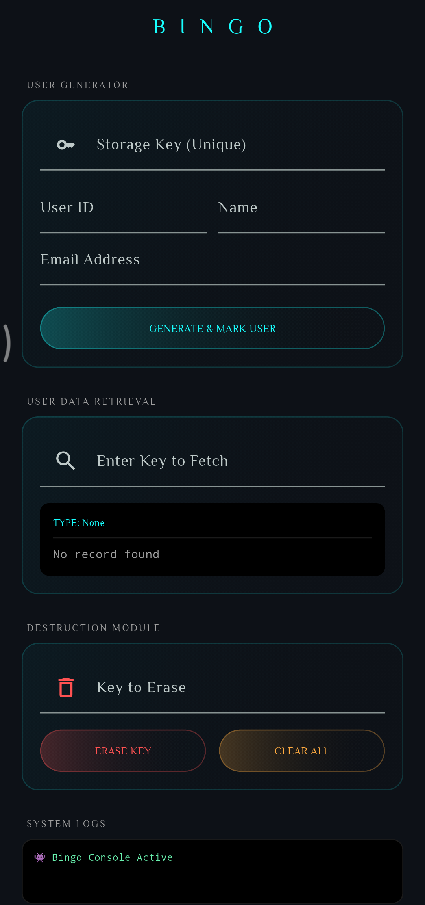

<div align="center">
    
</div>

---

[](https://github.com/RadoDayef/bingo)
[](https://pub.dev/packages/bingo/install)

**Bingo** is a high-performance, synchronous state-persistence engine for Flutter. It combines the speed of an in-memory cache with the reliability of a NoSQL database (Sembast).

Unlike other storage solutions, Bingo allows you to **retrieve complex objects synchronously** without `FutureBuilder` or `await` inside your build methods.

## ✨ Features

* **⚡ Zero-Latency Retrieval:** Access data synchronously from an optimized in-memory cache.
* **👤 Type-Safe Custom Objects:** Register factories to automatically turn JSON back into real Dart classes.
* **📋 Collection Support:** Seamlessly store and retrieve `List<T>` of custom objects.
* **🔄 Smart Merge:** Use `remark` to surgically update specific fields in a Map without overwriting the whole object.
* **🛡️ Pure Data:** Automatic "deep cleaning" through JSON serialization to ensure database integrity.
* **🚨 Debug Logger:** Built-in emoji logging to track your data flow during development.

---

## 📦 Installation

Add **Bingo** to your `pubspec.yaml` file:

```yaml
dependencies:
  bingo: ^1.0.0

```

Or install it via terminal:

```bash
flutter pub add bingo

```

### Import the package

```dart
import 'package:bingo/bingo.dart';

```

---

## 🚀 Getting Started

### 1. Initialize

In your `main.dart`, ensure the engine is warmed up before the app starts.

```dart
void main() async {
  WidgetsFlutterBinding.ensureInitialized();

  // Initialize the engine & load cache
  Bingo.setup();

  runApp(MyApp());
}
```

### 2. Register Your Models

If you want to store custom objects, register their `fromJson` factory once.

```dart
Bingo.register<User>((json) => User.fromJson(json));
```

---

## 🛠️ Usage

### Basic Storage (Primitives)

```dart
// Saving
Bingo.mark('username', 'neon_developer');
Bingo.mark('is_pro', true);

// Retrieving (Synchronous!)
String name = Bingo.call<String>('username') ?? 'Guest';
```

### Working with Objects

Bingo automatically looks for a `toJson()` or `toMap()` method to save your objects.

```dart
final user = User(id: '1', name: 'Mourad');

// Save the object
Bingo.mark('current_user', user);

// Retrieve it as a real User class instantly
User? cachedUser = Bingo.call<User>('current_user');
print(cachedUser?.name); // Mourad
```

### Surgical Updates (`remark`)

Updating a single field in a complex map without re-saving the entire object:

```dart
// Existing settings: {'theme': 'dark', 'notifications': true}
Bingo.remark('settings', {'theme': 'light'});

// New settings: {'theme': 'light', 'notifications': true}
```

### Deletion & Cleanup

```dart
Bingo.erase('temp_key'); // Delete one key
Bingo.clear();           // Nuke the entire database
```

---

## 📱 Example Preview

<div align="center">
    
</div>

---

## 🏗️ Architecture

Bingo is built on a "Synchronous-First" philosophy:

1. **Registry:** Maps your custom Types to factories.
2. **Handler:** Normalizes data (Lists, Objects, Primitives) into JSON-safe formats.
3. **Converter:** Ensures deep cleaning and stringifies Map keys.
4. **Engine:** Manages the Sembast IO connection and maintains the live `_cache` Map.
5. **Controller:** Coordinates the logic between the Public API and the Engine.

---

## 📜 License

This project is licensed under the MIT License - see the LICENSE file for details.

---

Made by [Rado Dayef](https://github.com/RadoDayef)
